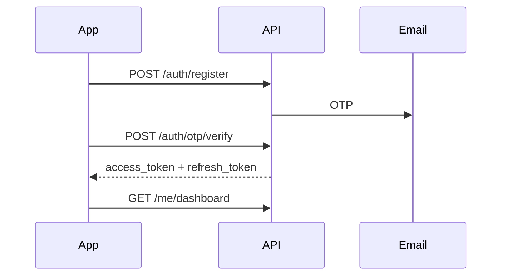
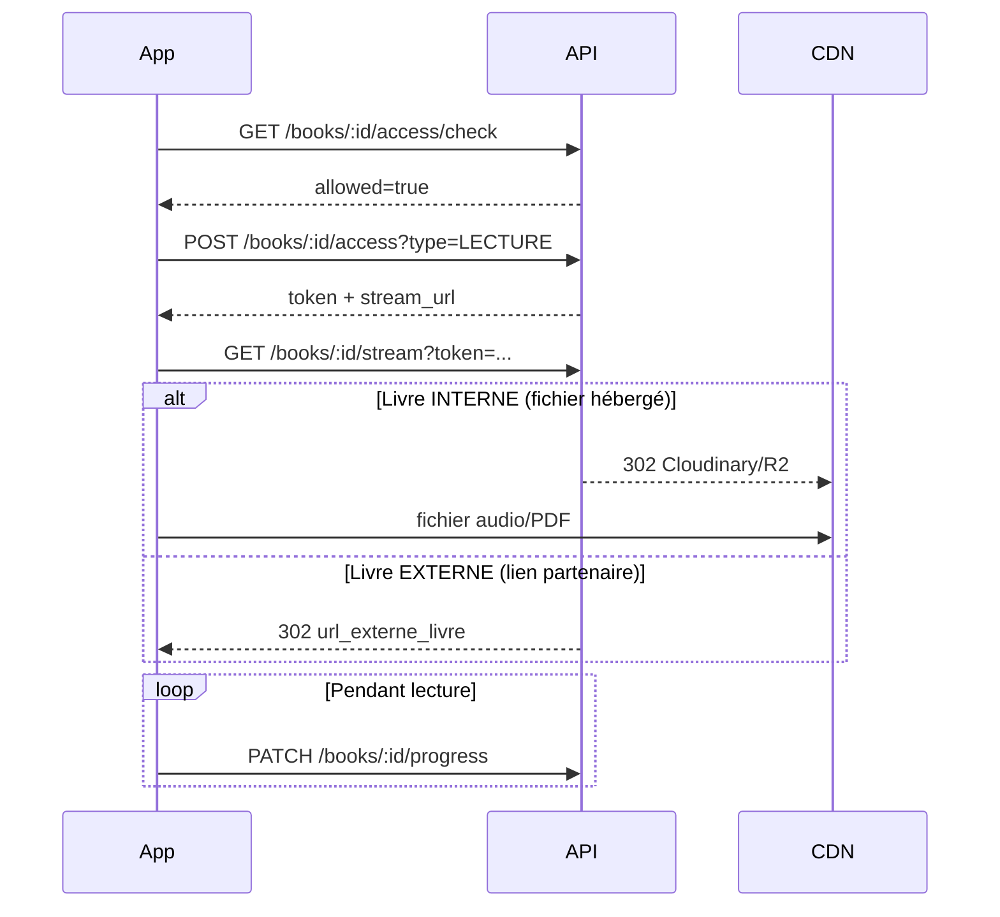
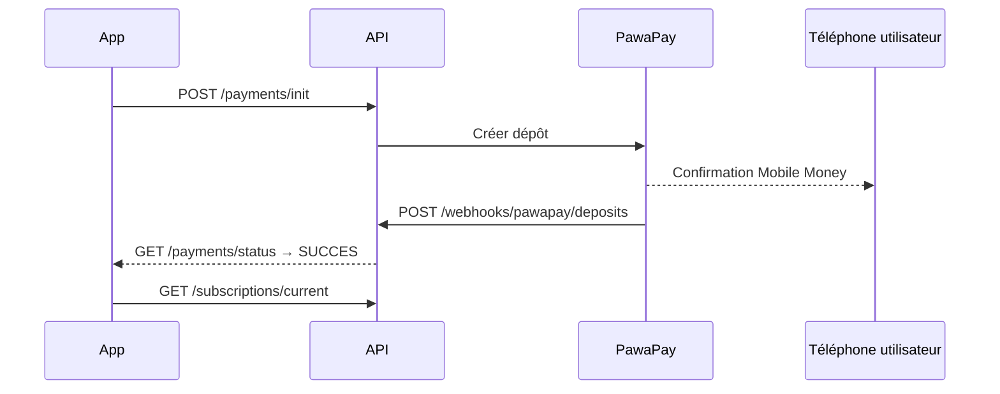

# BiblioTech API v2 — Backend

API REST NestJS pour **BiblioTech**, plateforme de lecture numérique (ebooks, audio) avec abonnements Mobile Money, bibliothèques thématiques, gamification et recommandations.

> **Public cible de ce document** : développeur frontend, intégrateur mobile, et toute personne qui consomme l’API sans lire le code source.

---

## Sommaire

1. [Démarrage rapide](#1-démarrage-rapide)
   - [Docker](#docker)
2. [Documentation interactive](#2-documentation-interactive)
3. [Authentification & sécurité](#3-authentification--sécurité)
4. [Conventions communes](#4-conventions-communes)
   - [Bibliothèques, livres et abonnement](#41-bibliothèques-types-de-livres-et-abonnement)
5. [Référence API (frontend)](#5-référence-api-frontend)
   - [Document complet](#document-api-complète)
   - [Parcours par module (résumé)](#parcours-par-module-résumé)
   - [Santé](#51-santé)
   - [Auth](#52-auth)
   - [Profil `/me`](#53-profil-me)
   - [Bibliothèques](#54-bibliothèques)
   - [Catalogue & lecture `/books`](#55-catalogue--lecture-books)
   - [Plans & abonnements](#56-plans--abonnements)
   - [Paiements](#57-paiements)
   - [Découverte](#58-découverte)
   - [Gamification](#59-gamification)
   - [Admin (back-office)](#510-admin-back-office)
6. [Flux critiques (schémas)](#6-flux-critiques-schémas)
7. [Variables d’environnement](#7-variables-denvironnement)
8. [Postman & tests](#8-postman--tests)
9. [Jobs planifiés (cron)](#9-jobs-planifiés-cron)
10. [Checklist prod (dans ~2 semaines)](#10-checklist-prod)

---

## 1. Démarrage rapide

### Prérequis

- Node.js 20+
- PostgreSQL 15+
- **PawaPay** (sandbox) + **ngrok** pour tester les paiements Mobile Money en local
- Optionnel selon les features : Resend, Google OAuth, Cloudinary, Cloudflare R2

### Installation

```bash
npm install
cp .env.example .env
# Éditer .env (DATABASE_URL, JWT_SECRET, PAWAPAY_API_TOKEN, PAWAPAY_PUBLIC_BASE_URL, etc.)
npm run db:sync
npm run db:seed
npm run start:dev
```

| Commande | Rôle |
|----------|------|
| `npm run start:dev` | Serveur avec rechargement à chaud |
| `npm run build` | Compilation TypeScript |
| `npm run start:prod` | `node dist/src/main` |
| `npm run db:sync` | Migrations + contraintes SQL + client Prisma |
| `npm run db:seed` | Données de démo (catalogue, défis, plans) |
| `npm run db:studio` | Interface Prisma Studio |

### Docker

Alternative au démarrage Node/PostgreSQL en local : **NestJS + PostgreSQL** containerisés (pas de Redis — le cache auth est en mémoire).

**Prérequis** : [Docker Desktop](https://www.docker.com/products/docker-desktop/) (ou Docker Engine + Compose v2).

**Développement** — API + PostgreSQL, migrations Prisma au démarrage, rechargement à chaud :

```bash
cp .env.example .env
# Renseigner JWT_SECRET, OTP_HMAC_SECRET, etc.
# POSTGRES_USER / POSTGRES_PASSWORD / POSTGRES_DB doivent correspondre au mot de passe DB
docker compose up --build
```

| Fichier | Rôle |
|---------|------|
| `docker-compose.yml` | Dev : services `app` (port 3000) et `postgres` (port hôte **5433** → 5432 dans le conteneur) |
| `Dockerfile` | Build multi-stage (`development` / `production`) |
| `docker/entrypoint.dev.sh` | `db:sync` puis `start:dev` |
| `docker/entrypoint.prod.sh` | `db:sync` puis `node dist/src/main` |

Le compose **surcharge** `DATABASE_URL` pour cibler le conteneur `postgres` (`@postgres:5432` en réseau Docker). Le `localhost:5432` du `.env` ne s’applique pas depuis l’app Docker. Depuis votre machine (Prisma Studio, client SQL), utilisez `localhost:5433` si `POSTGRES_PORT=5433`.

**Seed (optionnel, une fois les migrations terminées)** :

```bash
docker compose exec app npm run db:seed
```

**Production** — application seule ; PostgreSQL externe (Railway, Supabase, etc.). Variables injectées depuis l’environnement du serveur (pas de `.env` monté) :

```bash
export DATABASE_URL="postgresql://..."
export JWT_SECRET="..."
export OTP_HMAC_SECRET="..."
# … voir .env.example pour la liste complète

docker compose -f docker-compose.prod.yml up -d --build
```

`DATABASE_URL`, `JWT_SECRET` et `OTP_HMAC_SECRET` sont obligatoires (`:?` dans le compose prod).

**URLs** (identiques au démarrage local) : API `http://localhost:3000`, Swagger `/api/docs`, health `/health`.

**Paiements en local** : l’API tourne dans Docker ; exposez le port 3000 avec ngrok comme ci-dessous (`ngrok http 3000`).

**URLs locales par défaut**

| Service | URL |
|---------|-----|
| API | `http://localhost:3000` |
| Swagger | `http://localhost:3000/api/docs` |
| Health check | `http://localhost:3000/health` |

**Paiements en local (PawaPay sandbox)**

```bash
# Terminal 1
npm run start:dev

# Terminal 2 — exposer l’API pour les webhooks PawaPay
ngrok http 3000
```

Copier l’URL HTTPS ngrok dans `.env` :

```env
PAYMENT_PROVIDER=pawapay
PAWAPAY_PUBLIC_BASE_URL=https://VOTRE-ID.ngrok-free.app
PAYMENT_PUBLIC_BASE_URL=https://VOTRE-ID.ngrok-free.app
```

Dashboard PawaPay → Callback **Deposits** : `{PAWAPAY_PUBLIC_BASE_URL}/api/webhooks/pawapay/deposits`

---

## 2. Documentation interactive

- **Guide API frontend (prioritaire)** : [docs/FRONTEND-API-README.md](./docs/FRONTEND-API-README.md) — toutes les routes Swagger, champs obligatoires/facultatifs, exemples JSON, ordre d’implémentation
- **Référence API (résumé)** : [docs/API-REFERENCE.md](./docs/API-REFERENCE.md) — version condensée
- **Swagger UI** : `GET /api/docs` — DTO et exemples interactifs. Bouton **Authorize** pour le JWT
- **Postman** : dossier `postman/` — tests par domaine (PawaPay, Books, Admin…)
- **Ce README** : démarrage, conventions, parcours UX résumés

---

## 3. Authentification & sécurité

### Tokens JWT

| Token | Usage | Durée typique |
|-------|--------|----------------|
| `access_token` | Header `Authorization: Bearer <token>` sur presque toutes les routes | Courte |
| `refresh_token` | Uniquement `POST /auth/token/refresh` et `POST /auth/logout` | Longue |

### Statuts compte (`auth.statut`)

| Statut | Signification | Impact API |
|--------|---------------|------------|
| `PENDING` | Inscrit, email non validé | Connexion limitée ; pas d’accès « compte actif » |
| `ACTIF` | Compte utilisable | Accès catalogue, paiement, lecture |
| `BANNI` | Compte suspendu | 403 sur la plupart des routes |

### Guards (comportement réel)

| Guard | Effet |
|-------|--------|
| Aucun | Route publique |
| `JwtAuthGuard` | JWT valide **+** compte `ACTIF` |
| `JwtAuthenticatedGuard` | JWT valide (`PENDING` accepté) |
| `ActiveAccountGuard` | Compte `ACTIF` (souvent combiné avec JWT) |
| Rôle `ADMIN` | Routes `/admin/*` |

### CORS (navigateur)

Le frontend web **doit** appeler l’API depuis une origine listée dans `CORS_ORIGINS` (voir `.env.example`).

Origines locales par défaut en développement : `5173`, `3000`, `4200`.

En **production**, définir explicitement `CORS_ORIGINS=https://app.bibliotech.cg,...` — sinon les requêtes cross-origin sont refusées.

---

## 4. Conventions communes

### Pagination

Query : `page` (défaut `1`), `limit` (défaut `20`, max `100`).

Réponse type :

```json
{
  "data": [ ... ],
  "meta": { "page": 1, "limit": 20, "total": 142, "total_pages": 8 }
}
```

### Erreurs HTTP (toutes les APIs)

Corps JSON typique :

```json
{
  "statusCode": 403,
  "message": "Validez d'abord votre email via OTP.",
  "error": "Forbidden"
}
```

Si plusieurs champs invalides (ValidationPipe), `message` peut être un **tableau de strings**.

| Code | Quand | Exemples de `message` |
|------|--------|------------------------|
| **400** | Body/query invalide, règle métier | « Plan invalide », « Code OTP incorrect », « Terme trop court » |
| **401** | JWT absent, expiré, révoqué | « Unauthorized », « Token révoqué. », « Session invalide. » |
| **403** | Compte non actif, pas les droits, ressource d’un autre user | « Validez d'abord votre email via OTP. », « Compte suspendu. », « Abonnement actif requis. » |
| **404** | UUID inconnu | « Livre introuvable », « Transaction introuvable » |
| **409** | Doublon / conflit | « Email déjà utilisé », « Déjà inscrit à ce défi » |
| **410** | Jeton lecture consommé/expiré | Stream `/books/:id/stream` |
| **429** | Anti-abus progression | « Vitesse de lecture anormale. » |
| **502** | Prestataire externe | PawaPay, Cloudinary |
| **503** | Health check DB down | `/health` uniquement |

Champs interdits ou non déclarés dans le DTO → **400** (`forbidNonWhitelisted: true`).

### Identifiants

Tous les IDs exposés sont des **UUID** (`livre.id`, `plan_id`, `defiId`…).

### 4.1 Bibliothèques, types de livres et abonnement

> **À lire avant** les sections [Bibliothèques](#54-bibliothèques) et [Catalogue & lecture](#55-catalogue--lecture-books). Détail condensé : [docs/API-REFERENCE.md](./docs/API-REFERENCE.md#modèle-daccès-bibliothèques-livres-abonnement).

Deux notions **indépendantes** coexistent dans le modèle de données. Ne pas les confondre côté frontend.

| Notion | Enum Prisma | Rôle |
|--------|-------------|------|
| **Type de bibliothèque** (rayon) | `TypeBibliotheque` | **INTERNE** = catalogue de livres en base (liens `appartient`) · **EXTERNE** = lien unique `url_externe` vers un site partenaire, **sans livre** dans le catalogue |
| **Type de livre** (mode de diffusion) | `TypeLivre` | **INTERNE** = fichier hébergé (Cloudinary / R2) · **EXTERNE** = redirection vers `url_externe_livre` (partenaire) |

#### Cas métier : rayon interne avec livres internes et externes

Dans une **bibliothèque INTERNE**, l’admin peut associer des livres **INTERNE** (PDF/EPUB/audio hébergés) et des livres **EXTERNE** (lien seulement). C’est le scénario « catalogue BiblioTech + ouvrages chez un éditeur partenaire ».

Une **bibliothèque EXTERNE** (rayon) n’expose **pas** `GET /libraries/:id/books` : l’API renvoie **400** — l’utilisateur doit utiliser `url_externe` de la fiche bibliothèque (`acces_livres: EXTERNE_REDIRECT`).

#### Abonnement : quand est-il requis ?

| Action | Abonnement actif requis ? |
|--------|---------------------------|
| Parcourir listes / fiches (`GET /libraries`, `/libraries/:id/books`, `GET /books`, `GET /books/:id`) | **Non** (JWT + compte ACTIF suffisent) — la fiche livre expose `peut_lire`, `peut_telecharger`, `raison_blocage` |
| Ouvrir un livre (jeton + stream) | **Oui** — `evaluateBookAccess` dans `books-access.eligibility.ts` |
| Sauvegarder la progression (`PATCH /books/:id/progress`) | **Oui** |
| Commenter / noter | **Oui** + livre rattaché à **au moins une** bibliothèque **INTERNE** (le livre peut être `TypeLivre.EXTERNE`) |

L’abonnement actif = `statut ACTIF`, `date_debut ≤ now < date_fin` (tous les plans : hebdo, mensuel, annuel — **pas** de restriction par type de livre dans le code).

#### Lecture vs téléchargement (même abonnement, règles différentes)

| Type livre | Ressource | Lecture (`type=LECTURE`) | Téléchargement (`type=TELECHARGEMENT`) |
|------------|-----------|--------------------------|----------------------------------------|
| **INTERNE** | `cloudinary_public_id` ou clé R2 | Oui si abonnement + livre `PUBLIE` | Oui si en plus `is_downloadable=true` **et** progression déjà créée (première ouverture via `/access`) |
| **EXTERNE** | `url_externe_livre` | Oui si abonnement + URL renseignée → stream = **302 vers le partenaire** | **Non** — `is_downloadable` est **forcé à `false`** à la création (contrainte admin + code) |

Codes de blocage possibles (`GET /books/:id/access/check`) : `ABONNEMENT_REQUIS`, `LIVRE_INDISPONIBLE`, `RESSOURCE_MANQUANTE`, `NON_TELECHARGEABLE`, `PROGRESSION_REQUISE`.

#### Flux lecture (interne ou externe)

```text
GET /books/:id/access/check?type=LECTURE
  → peut_lire / eligible / codes / raison_blocage
POST /books/:id/access?type=LECTURE
  → token + stream_url (/books/:id/stream?token=...)
GET /books/:id/stream?token=...
  → INTERNE : 302 vers Cloudinary/R2
  → EXTERNE : 302 vers url_externe_livre
PATCH /books/:id/progress   (abonnement requis)
```

**Frontend** : pour un livre `type_livre=EXTERNE`, afficher « Lire sur le site partenaire » plutôt qu’un lecteur intégré ; ne pas proposer de téléchargement même si l’utilisateur est abonné.

---

## 5. Référence API (frontend)

Chaque endpoint est documenté avec :

1. **Usage concret** — quel écran ou action utilisateur dans l’app  
2. **Entrée** — body JSON, query, path, multipart  
3. **Réponse** — format JSON en cas de succès (code HTTP)  
4. **Erreurs** — codes HTTP et messages métier possibles  

### Document API complète

**→ [docs/FRONTEND-API-README.md](./docs/FRONTEND-API-README.md)** — document **complet** généré depuis Swagger (champs, exemples, workflow). À copier tel quel pour votre agent IA frontend.

**→ [docs/API-REFERENCE.md](./docs/API-REFERENCE.md)** — version condensée (même contenu, moins de détail).

Régénérer après changement d’API : `npm run docs:frontend` (compile le projet pour que Swagger lise les DTOs à jour)

Swagger interactif : `http://localhost:3000/api/docs` (schémas DTO synchronisés avec le code).

Régénérer la doc après modification d’API :

```bash
node tools/generate-api-reference.mjs
```

### Parcours par module (résumé)

Légende : **Auth** = JWT requis | **Actif** = compte `ACTIF` | **Public** = sans token  
Pour le détail **Entrée / Réponse / Erreurs** de chaque ligne ci-dessous → [API-REFERENCE.md](./docs/API-REFERENCE.md).

---

### 5.1 Santé

| Méthode | Route | Auth | Dans la vraie vie |
|---------|-------|------|-------------------|
| `GET` | `/` | Public | Ping simple : l’API répond. Monitoring basique. |
| `GET` | `/health` | Public | Sonde Kubernetes / uptime : vérifie aussi PostgreSQL (`database: up`). |

---

### 5.2 Auth — `/auth`

Toutes les routes d’inscription/connexion. **Le frontend ne doit jamais stocker le mot de passe en clair** ; seulement les tokens après succès.

| Méthode | Route | Auth | Dans la vraie vie |
|---------|-------|------|-------------------|
| `POST` | `/auth/register` | Public | Écran « Créer un compte » : email + nom/prénom → envoi OTP par email. Pas de tokens ici. |
| `POST` | `/auth/register/password` | Public | Même chose avec mot de passe dès l’inscription ; activation toujours par OTP. |
| `POST` | `/auth/otp/request` | Public | « Se connecter par email » ou bouton « Renvoyer le code ». |
| `POST` | `/auth/otp/verify` | Public | Saisie du code à 6 chiffres → **reçoit `access_token` + `refresh_token` + `user`**. Champ `is_new_user` pour l’onboarding. |
| `POST` | `/auth/google` | Public | Après Google Sign-In : envoyer `id_token` (pas l’access token OAuth générique). Crée ou connecte le compte. |
| `POST` | `/auth/google/link` | Actif | Paramètres : lier Google à un compte créé par OTP. |
| `POST` | `/auth/password/add` | Actif | Ajouter un mot de passe à un compte sans mot de passe. |
| `POST` | `/auth/password/change` | Actif | Changement de mot de passe (ancien + nouveau). |
| `POST` | `/auth/password/login` | Public | Connexion classique email + mot de passe. |
| `POST` | `/auth/password/reset/request` | Public | « Mot de passe oublié » → email avec OTP/code. |
| `POST` | `/auth/password/reset/confirm` | Public | Nouveau mot de passe après code reçu. |
| `POST` | `/auth/token/refresh` | Public* | Renouveler l’`access_token` avec le `refresh_token` (body). |
| `POST` | `/auth/logout` | Public* | Invalider le refresh token (déconnexion). |

\* Body contient le `refresh_token`, pas le header Bearer classique.

**Ordre typique frontend — nouvel utilisateur**

1. `register` → 2. `otp/verify` → stocker tokens → 3. `GET /me/dashboard`

---

### 5.3 Profil — `/me`

Espace personnel. Toutes les routes : **Auth + Actif**.

| Méthode | Route | Dans la vraie vie |
|---------|-------|-------------------|
| `GET` | `/me` | Écran « Mon compte » : identité, email, photo, points. |
| `GET` | `/me/dashboard` | **Home connectée** : un seul appel pour widgets (lecture en cours, stats, prochain badge, défis). |
| `GET` | `/me/reading` | « Ma bibliothèque » : livres en cours / terminés (`?statut=`). |
| `GET` | `/me/activity` | Timeline « Activité récente » (badge, défi, fin de livre…). |
| `GET` | `/me/completion` | Barre de complétion du profil (photo, nom, abonnement…). |
| `GET` | `/me/actions` | Cartes CTA dynamiques (« Choisir un plan », « Rejoindre un défi »). |
| `PATCH` | `/me` | Formulaire d’édition profil. |
| `POST` | `/me/photo` | Upload avatar (multipart) → Cloudinary. |
| `DELETE` | `/me/photo` | Supprimer la photo de profil. |
| `GET` | `/me/badges/summary` | Aperçu badges sur le profil. |
| `GET` | `/me/badges` | Liste complète des badges obtenus. |
| `GET` | `/me/challenges/summary` | Résumé défis en cours pour le profil. |
| `GET` | `/me/challenges` | Liste des défis de l’utilisateur. |
| `GET` | `/me/challenges/:defiId` | Détail d’un défi personnel. |
| `GET` | `/me/stats` | Statistiques globales (lecture, social). |
| `GET` | `/me/stats/reading` | Stats lecture détaillées. |
| `GET` | `/me/stats/social` | Stats commentaires / notes. |
| `GET` | `/me/comments` | Historique des commentaires postés par l’utilisateur. |
| `GET` | `/me/ratings` | Historique des notes données. |

---

### 5.4 Bibliothèques — `/libraries`

Collections éditoriales (rayons thématiques). **Auth + Actif**.

Voir [§4.1 Bibliothèques, types de livres et abonnement](#41-bibliothèques-types-de-livres-et-abonnement) : seules les bibliothèques **INTERNE** ont un catalogue de livres ; les livres **EXTERNE** (lien partenaire) peuvent y figurer à côté des livres hébergés.

| Méthode | Route | Dans la vraie vie |
|---------|-------|-------------------|
| `GET` | `/libraries/summary` | Bannière « Explorer les bibliothèques » (compteurs globaux). |
| `GET` | `/libraries` | Grille de cartes bibliothèques. |
| `GET` | `/libraries/:id` | Page détail d’une bibliothèque (description, image). |
| `GET` | `/libraries/:id/stats` | Sous-titre stats (nb livres, auteurs…). |
| `GET` | `/libraries/:id/categories` | Chips / filtres par catégorie. |
| `GET` | `/libraries/:id/books/in-progress` | « Continuer dans [Bibliothèque] ». |
| `GET` | `/libraries/:id/books` | Catalogue filtré d’une bib. **INTERNE** (`type_livre?` pour filtrer INTERNE/EXTERNE). **400** si bib. rayon **EXTERNE**. |

---

### 5.5 Catalogue & lecture — `/books`

Cœur métier : catalogue, accès aux fichiers, progression, avis. **Auth + Actif** (sauf commentaires listés avec JWT).

**Abonnement** : requis pour ouvrir un livre (jeton) et pour la progression — **sans distinction** livre interne/externe dans un rayon interne. Voir [§4.1](#41-bibliothèques-types-de-livres-et-abonnement).

| Méthode | Route | Dans la vraie vie |
|---------|-------|-------------------|
| `GET` | `/books` | Grille catalogue + recherche/filtres (`q`, `bibliotheque_id`, `categorie_id`…). Fiche détail : `peut_lire`, `peut_telecharger`, `acces_type` (`CLOUDINARY` \| `EXTERNE`). |
| `GET` | `/books/access/recent` | Section « Reprendre la lecture ». |
| `GET` | `/books/:id` | Fiche livre complète. |
| `GET` | `/books/:id/resource` | Infos techniques (durée audio, pages PDF) **sans** consommer de quota. |
| `GET` | `/books/:id/access/check` | Avant « Lire » : vérifie abonnement & quotas (`?type=LECTURE\|TELECHARGEMENT`). |
| `GET` | `/books/:id/access/active` | Récupère un jeton encore valide (évite un nouvel accès). |
| `GET` / `POST` | `/books/:id/access` | Génère un **jeton temporaire** (`?type=LECTURE\|TELECHARGEMENT`). |
| `GET` | `/books/:id/stream` | Ouvre le lecteur : **302** vers le fichier avec `?token=...`. `?validate=true` pour test JSON. |
| `GET` | `/books/:id/similar` | Carrousel « Vous aimerez aussi ». |
| `GET` | `/books/:id/challenges` | Encart défis liés à ce livre. |
| `GET` | `/books/:id/progress` | Reprendre à la bonne page / position. |
| `PATCH` | `/books/:id/progress` | Sauvegarde périodique depuis le lecteur (debounce côté app). |
| `GET` | `/books/:id/comments` | Fil des avis publics. |
| `POST` | `/books/:id/comments` | Publier un avis. |
| `PATCH` | `/books/:id/comments/:commentId` | Modifier son commentaire. |
| `DELETE` | `/books/:id/comments/:commentId` | Supprimer son commentaire. |
| `POST` | `/books/:id/rate` | Noter le livre (1–5). |
| `PATCH` | `/books/:id/rate` | Modifier sa note. |

**Flux lecture (obligatoire côté frontend)**

```
GET /books/:id
  → GET /books/:id/access/check?type=LECTURE
  → GET /books/:id/access/active?type=LECTURE  (optionnel)
  → POST /books/:id/access?type=LECTURE
  → GET /books/:id/stream?token=<jeton>   (WebView, <audio>, lecteur PDF)
  → PATCH /books/:id/progress  (pendant la lecture)
```

---

### 5.6 Plans & abonnements

#### Plans publics — `/plans`

| Méthode | Route | Auth | Dans la vraie vie |
|---------|-------|------|-------------------|
| `GET` | `/plans` | Public | Page tarifs avant connexion. |
| `GET` | `/plans/:id` | Public | Détail d’une offre (hebdo / mensuel / annuel). |

#### Abonnement utilisateur — `/subscriptions`

**Auth** (PENDING accepté pour consultation).

| Méthode | Route | Dans la vraie vie |
|---------|-------|-------------------|
| `GET` | `/subscriptions/current` | Bannière « Mon abonnement », contrôle d’accès aux livres. |
| `GET` | `/subscriptions/upcoming` | « Renouvellement le … » si déjà payé d’avance. |
| `GET` | `/subscriptions/summary` | Widget résumé dans les paramètres. |
| `GET` | `/subscriptions/compare` | Écran « Changer d’offre » avec upgrade/downgrade. |
| `GET` | `/subscriptions/history` | Historique des périodes d’abonnement. |

---

### 5.7 Paiements — PawaPay (Mobile Money)

**Prestataire en production et en développement** : **PawaPay** (MTN / Airtel Congo-Brazzaville).

Configurer dans `.env` :

```env
PAYMENT_PROVIDER=pawapay
PAWAPAY_MODE=sandbox
PAWAPAY_API_TOKEN=<token dashboard>
PAWAPAY_PUBLIC_BASE_URL=https://VOTRE-ID.ngrok-free.app
```

> Le mode `mock` (`POST /payments/mock/simulate`) existe uniquement pour du debug backend **sans** ngrok. **Ne pas** l’utiliser pour valider l’intégration frontend ni avant livraison.

#### Routes utilisateur — `/payments`

| Méthode | Route | Auth | Dans la vraie vie |
|---------|-------|------|-------------------|
| `GET` | `/payments/checkout-preview` | Actif | Page récap avant paiement : montant, plan, prorata. Query `?plan_id=`. |
| `GET` | `/payments/pending` | Auth | Liste des paiements en cours (écran « Paiement en attente »). |
| `GET` | `/payments/status` | Auth | Polling après dépôt Mobile Money : `?transaction_id=`. |
| `POST` | `/payments/init` | Actif | Lance le dépôt PawaPay → `ref_transaction`, `payment_url`, `pawapay.deposit_id`. Body : `plan_id`, `phonenumber`, `operator`. |
| `GET` | `/payments/return` | Public | URL de retour navigateur après paiement (deep link / page web). |

#### Webhooks PawaPay — `/api/webhooks/pawapay`

| Méthode | Route | Appelé par |
|---------|-------|------------|
| `GET` / `POST` | `/api/webhooks/pawapay/deposits` | PawaPay — **confirmation du dépôt** (active l’abonnement) |
| `POST` | `/api/webhooks/pawapay/payouts` | PawaPay |
| `POST` | `/api/webhooks/pawapay/refunds` | PawaPay |

> **Le frontend ne doit jamais appeler les webhooks.** Callbacks serveur-à-serveur uniquement.

#### Flux paiement PawaPay (sandbox / production)

1. `GET /plans` → récupérer `plan_id`
2. `GET /payments/checkout-preview?plan_id=...`
3. `POST /payments/init` avec `{ "plan_id", "phonenumber": "24206…", "operator": "MTN_MOMO_COG" }` (ou `AIRTEL_COG`)
4. Sandbox : callback `COMPLETED` automatique en quelques secondes ; prod : validation sur le téléphone
5. PawaPay appelle `POST /api/webhooks/pawapay/deposits` sur votre URL publique (ngrok en dev)
6. Le backend active l’abonnement ; le frontend poll `GET /payments/status?transaction_id=...`
7. `GET /subscriptions/current` pour rafraîchir l’UI

**Dashboard PawaPay** → Callback Deposits :

`{PAWAPAY_PUBLIC_BASE_URL}/api/webhooks/pawapay/deposits`

**Opérateurs** : `MTN_MOMO_COG`, `AIRTEL_COG` (ou déduction auto via préfixe MSISDN : `06` → MTN, `05`/`04` → Airtel).

---

### 5.8 Découverte

#### Recherche — `/search` (Auth + Actif)

| Méthode | Route | Dans la vraie vie |
|---------|-------|-------------------|
| `GET` | `/search` | Barre de recherche globale (livres, auteurs…). |
| `GET` | `/search/history` | Suggestions / recherches récentes. |
| `DELETE` | `/search/history` | Effacer tout l’historique. |
| `DELETE` | `/search/history/:id` | Swipe delete sur une suggestion. |
| `PATCH` | `/search/history/:id/click` | Enregistrer un clic sur une suggestion. |

#### Recommandations — `/recommendations` (Auth + Actif)

| Méthode | Route | Dans la vraie vie |
|---------|-------|-------------------|
| `GET` | `/recommendations` | Feed principal de suggestions. |
| `GET` | `/recommendations/summary` | Widget home « Pour vous ». |
| `GET` | `/recommendations/picks` | Sélection éditoriale / algorithmique. |
| `GET` | `/recommendations/by-reason` | Filtre par motif (`RAISON`). |
| `GET` | `/recommendations/for-book/:livreId` | Suggestions depuis une fiche livre. |
| `POST` | `/recommendations/refresh` | Forcer un recalcul (bouton « Actualiser »). |
| `PATCH` | `/recommendations/mark-all-seen` | Marquer tout comme vu. |
| `GET` | `/recommendations/:id` | Détail d’une recommandation. |
| `PATCH` | `/recommendations/:id/interact` | Clic / ouverture (améliore le moteur). |
| `PATCH` | `/recommendations/:id/dismiss` | Masquer une suggestion. |

#### Notifications — `/notifications` (Auth + Actif)

| Méthode | Route | Dans la vraie vie |
|---------|-------|-------------------|
| `GET` | `/notifications` | Centre de notifications in-app. |
| `PATCH` | `/notifications/read-all` | Tout marquer comme lu. |
| `PATCH` | `/notifications/:id/read` | Marquer une notification lue. |

---

### 5.9 Gamification

#### Défis — `/challenges` (Auth + Actif)

| Méthode | Route | Dans la vraie vie |
|---------|-------|-------------------|
| `GET` | `/challenges` | Liste des défis disponibles. |
| `GET` | `/challenges/recommended` | Défis suggérés pour l’utilisateur. |
| `GET` | `/challenges/expiring` | Défis qui se terminent bientôt (urgence UX). |
| `GET` | `/challenges/:id` | Page détail d’un défi. |
| `GET` | `/challenges/:id/stats` | Stats globales du défi. |
| `GET` | `/challenges/:id/progress` | Progression personnelle (jalons, %). |
| `POST` | `/challenges/:id/join` | Bouton « Participer ». |
| `DELETE` | `/challenges/:id/join` | Se désinscrire du défi. |

#### Badges — `/badges` (Auth + Actif)

| Méthode | Route | Dans la vraie vie |
|---------|-------|-------------------|
| `GET` | `/badges` | Galerie de tous les badges. |
| `GET` | `/badges/next` | Prochain badge à débloquer (motivation). |
| `GET` | `/badges/:id` | Fiche badge. |
| `GET` | `/badges/:id/path` | Étapes pour débloquer ce badge. |

#### Vue agrégée — `/gamification`

| Méthode | Route | Dans la vraie vie |
|---------|-------|-------------------|
| `GET` | `/gamification/overview` | Écran d’accueil gamification : points + défis + badges en un appel. |

---

### 5.10 Admin (back-office)

Préfixe `/admin/*`. **JWT + rôle ADMIN** (**46 opérations**). Inventaire Swagger : [ADMIN-ROUTES-SWAGGER.md](./docs/ADMIN-ROUTES-SWAGGER.md) · [API-REFERENCE.md § 10](./docs/API-REFERENCE.md#10-admin--admin).

| Domaine | Routes principales | Dans la vraie vie |
|---------|-------------------|-------------------|
| **Utilisateurs** | `GET/POST /admin/users`, `GET/PATCH ban/unban :id` | Support client, modération comptes. |
| **Livres** | CRUD `/admin/books`, archive, catégories, auteurs | Gestion du catalogue (multipart fichier). |
| **Bibliothèques** | CRUD `/admin/libraries`, associer livres | Organisation éditoriale. |
| **Auteurs** | CRUD `/admin/auteurs` | Référentiel auteurs. |
| **Catégories** | CRUD `/admin/categories` | Taxonomie. |
| **Plans** | CRUD `/admin/plans` | Tarifs et durées. |
| **Défis** | CRUD `/admin/challenges`, participants | Campagnes gamification. |
| **Badges** | CRUD `/admin/badges` | Récompenses (upload icône). |
| **Commentaires** | `GET`, modération, suppression | Modération avis. |
| **Abonnements** | `GET`, annulation `:id/cancel` | Support abonnements. |
| **Paiements** | `GET /admin/payments` | Suivi transactions. |
| **Stats** | `dashboard`, `books`, `users`, `search-terms` | Tableaux de bord analytics. |

Erreurs admin fréquentes : **403** non-admin, **409** doublons (email, ISBN, nom badge…), **400** validation fichiers.

---

## 6. Flux critiques (schémas)

### Onboarding



### Lecture d’un livre



### Abonnement (PawaPay)



---

## 7. Variables d’environnement

Copier `.env.example` vers `.env`. Ne **jamais** committer `.env`.

| Variable | Obligatoire | Description |
|----------|-------------|-------------|
| `DATABASE_URL` | Oui | PostgreSQL |
| `JWT_SECRET` | Oui | Signature access/refresh tokens |
| `OTP_HMAC_SECRET` | Oui | Hash des codes OTP |
| `RESEND_API_KEY` | Oui* | Emails OTP (* sauf tests sans email) |
| `GOOGLE_CLIENT_ID` | Si Google Sign-In | |
| `CLOUDINARY_URL` | Si images | Couvertures, avatars, badges |
| `R2_*` | Si livres internes | PDF/EPUB sur Cloudflare R2 |
| `CORS_ORIGINS` | Recommandé | Origines frontend autorisées |
| `PAYMENT_PROVIDER` | Oui | **`pawapay`** (valeur attendue en dev et prod) |
| `PAWAPAY_API_TOKEN` | Oui | Token API dashboard PawaPay |
| `PAWAPAY_MODE` | Oui | `sandbox` ou `production` |
| `PAWAPAY_PUBLIC_BASE_URL` | Oui en dev | URL HTTPS publique (ngrok) pour les webhooks |
| `PAYMENT_PUBLIC_BASE_URL` | Oui | Même base URL publique (retours navigateur) |
| `PAYMENT_PROVIDER=mock` | Non | Uniquement debug sans PawaPay/ngrok — hors parcours normal |

---

## 8. Postman & tests

### Collection complète (recommandée)

Importer **`postman/BiblioTech-Complet-Tests.postman_collection.json`** — tous les endpoints, **paiements PawaPay** par défaut (dossier 06).

Guide pas à pas : **`postman/GUIDE-TESTS-POSTMAN.md`**.

Prérequis Postman : `PAYMENT_PROVIDER=pawapay`, ngrok actif, variable `publicBaseUrl` = URL ngrok.

### Autres collections (par domaine)

`BiblioTech-PawaPay-Payments`, `BiblioTech-E2E-Admin-Lecture`, uploads Cloudinary/R2, etc.

Ordre conseillé pour un premier test bout-en-bout :

1. `BiblioTech-Auth` → login
2. `BiblioTech-PawaPay-Payments` ou dossier **06** de la collection complète
3. `BiblioTech-Libraries` → `BiblioTech-Books` (accès lecture après abonnement actif)

### Commandes test

```bash
npm test          # unitaires
npm run test:e2e  # e2e minimal
npm run build     # vérifier la compilation
```

---

## 9. Jobs planifiés (cron)

Activés si `CRON_ENABLED=true`. Désactiver en local si besoin (`false`).

| Job | Rôle |
|-----|------|
| `cleanup-otp` | Supprime les OTP expirés |
| `cleanup-token-lecture` | Purge les jetons d’accès lecture anciens |
| `reset-7j-stats` | Remet à zéro les compteurs « lectures 7 jours » |
| `expire-subscriptions` | Passe les abonnements expirés en inactif |
| `close-expired-challenges` | Clôture les défis terminés |
| `generate-recommendations` | Régénère les recommandations utilisateurs |

---

## 10. Checklist prod

À valider avant mise en production (d’ici ~2 semaines) :

- [ ] `NODE_ENV=production`
- [ ] `CORS_ORIGINS` = domaines réels du frontend
- [ ] `JWT_SECRET` / `OTP_HMAC_SECRET` forts et uniques
- [ ] `PAYMENT_PROVIDER=pawapay` + credentials production
- [ ] `PAWAPAY_PUBLIC_BASE_URL` = domaine API HTTPS public
- [ ] Webhooks PawaPay configurés dans le dashboard
- [ ] PostgreSQL managé + sauvegardes
- [ ] R2 + Cloudinary en production
- [ ] Resend : domaine d’envoi vérifié
- [ ] `CRON_ENABLED=true` sur l’instance qui exécute les jobs
- [ ] Sonde monitoring sur `GET /health`

---

## Stack technique

| Couche | Technologie |
|--------|-------------|
| Framework | NestJS 11 |
| ORM | Prisma 7 + PostgreSQL |
| Auth | JWT + Passport, OTP email, Google |
| Docs | Swagger (`/api/docs`) |
| Fichiers | Cloudinary (images), R2 (ebooks) |
| Paiements | PawaPay (Mobile Money — MTN / Airtel) |
| Emails | Resend |

---

## Support & contact

Pour toute ambiguïté sur un endpoint : **Swagger** (`/api/docs`) fait foi pour les paramètres exacts ; ce README fait foi pour **l’intention produit** et les parcours UX.

*Documentation générée pour BiblioTech API v2.0.0 — backend prêt pour intégration frontend en développement.*
